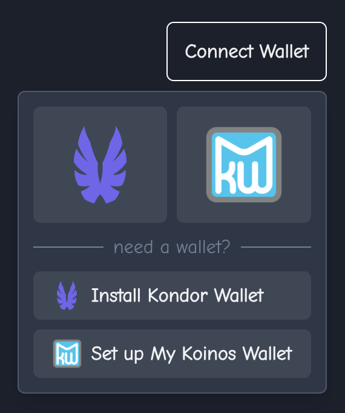
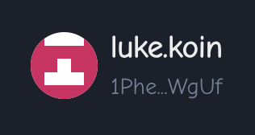
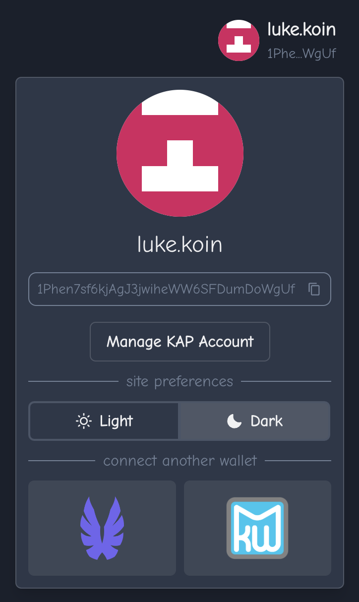

# react-koinos-toolkit
Reusable React components for common, Koinos-specific dApp needs


## Quick Start

Your dApp is going to need a way for users to connect their wallet. By including this package and setting up the `KoinosAccountProvider` and `KoinosAccountConnector` you get the following experience:

Before connecting:

Click to open ->


After connecting:

Click to open ->


### KoinosAccountProvider

In your root app component, set up the provider like so:

```
import { KoinosAccountProvider } from "react-koinos-toolkit";

function App() {
    return (
        <KoinosAccountProvider
            defaultRpcUrl={KOINOS_RPC}
            kapNameServiceAddress={KAP_NAME_SERVICE_ADDRESS}
            kapProfileAddress={KAP_PROFILE_ADDRESS}
        >
            your app components
        </KoinosAccountProvider>
    )
}
```

For Koinos mainnet, use the following variables:

```
KOINOS_RPC=https://api.koinos.io
KAP_NAME_SERVICE_ADDRESS=13tmzDmfqCsbYT26C4CmKxq86d33senqH3
KAP_PROFILE_ADDRESS=1EttfMuvTXGh8oE6vLiRF5JfqBvRiofFkB
```

Note: You will need a [koinos.pro](https://koinos.pro) RPC URL once the above API node is deprecated.

### KoinosAccountConnector

```
import { KoinosAccountConnector } from "react-koinos-toolkit";

function Header() {
    return (
        <KoinosAccountConnector sitePreferences={<MySitePreferencesComponent />} />
    )
}
```

For this setup, you can configure a light/dark theme toggle, or any other components you may want to show up under the `--- site preferences ---` divider in the connected dropdown.

### useAccount

You will probably need to get the address of the connected wallet somewhere in your site. You'll use the `useAccount` hook to accomplish this.

```
import { useAccount } from "react-koinos-toolkit";

function MyComponent() {
    const { address, signer, provider } = useAccount();
}
```

You can do this from anywhere inside a child of the `KoinosAccountProvider`. For reference:

- `address` is the address of the connected wallet
- `signer` and `provider` can be used to talk to the blockchain without needing to know which wallet is being used.

For example, if you want to call a contract entry point using [koilib](https://github.com/joticajulian/koilib), you'd set it up like so:

```
import { useAccount } from "react-koinos-toolkit";
import { Contract } from "koilib";

function MyNftMinter() {
    const { address, signer, provider } = useAccount();
    const nftContract = new Contract({
        id: "address of your NFT",
        abi: nftAbi,
        provider,
        signer
    });
    const mint = async (mintParams) => (
        await nftContract.functions.mint(mintParams)
    );
    // return some button that mints on click
}
```

## Supported Wallets

For the moment, react-koinos-toolkit only supports [Kondor](https://chrome.google.com/webstore/detail/kondor/ghipkefkpgkladckmlmdnadmcchefhjl) and [MKW](https://mykw.vercel.app/).

This will be updated to support Portal and Konio in the near future. Additional wallets will be considered. If you want to request support for another wallet, please open an issue on this repository. 

## Package Weight, Theming, and TypeScript

This package has not been optimized yet, so it's heavier than it needs to be. It currently depends on Chakra UI, which is a great UI library, but I would like to remove the dependency in a future update. 

If you want to override the styles of the connector, you can place your own `ChakraProvider` with your own theming inside the `KoinosAccountProvider`.

```
<KoinosAccountProvider>
    <ChakraProvider theme={myTheme}>
        KoinosAccountConnector and your own components go in here
    </ChakraProvider>
</KoinosAccountProvider>
```

Types have not been generated for this project yet, so if you're using TypeScript, you may need to import with an `@ts-ignore` comment.

```
import {
  KoinosAccountProvider,
  // @ts-ignore
} from "react-koinos-toolkit";
```